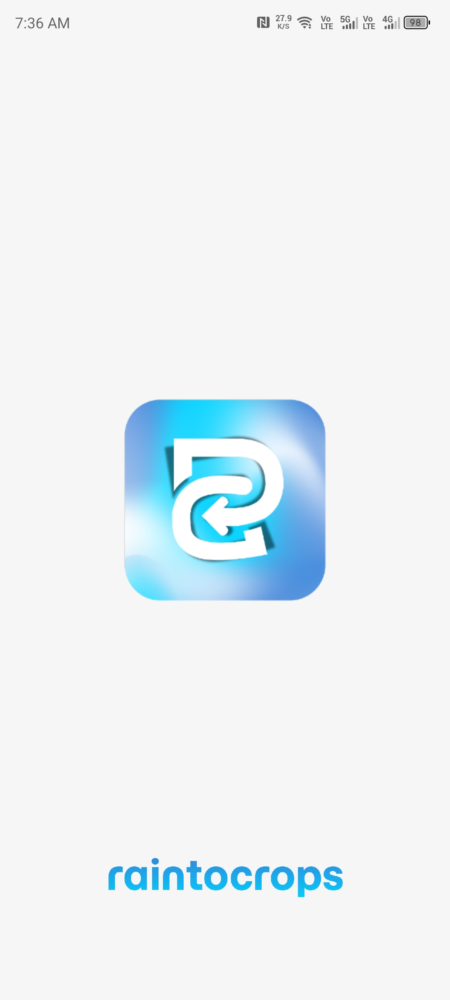
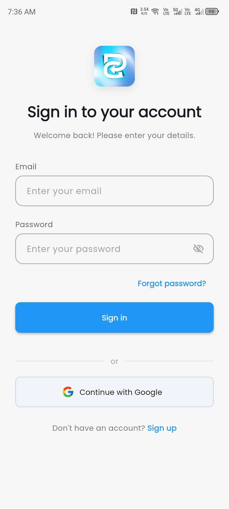
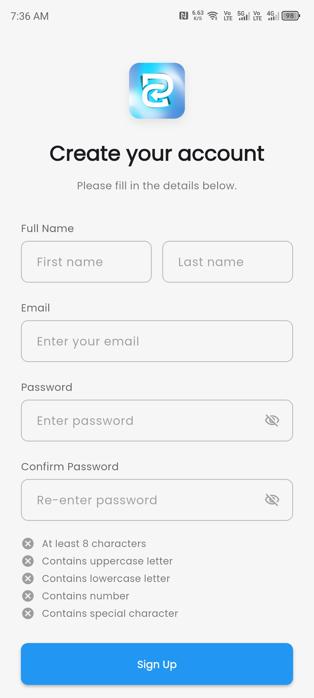
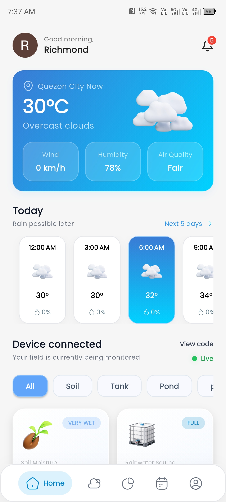
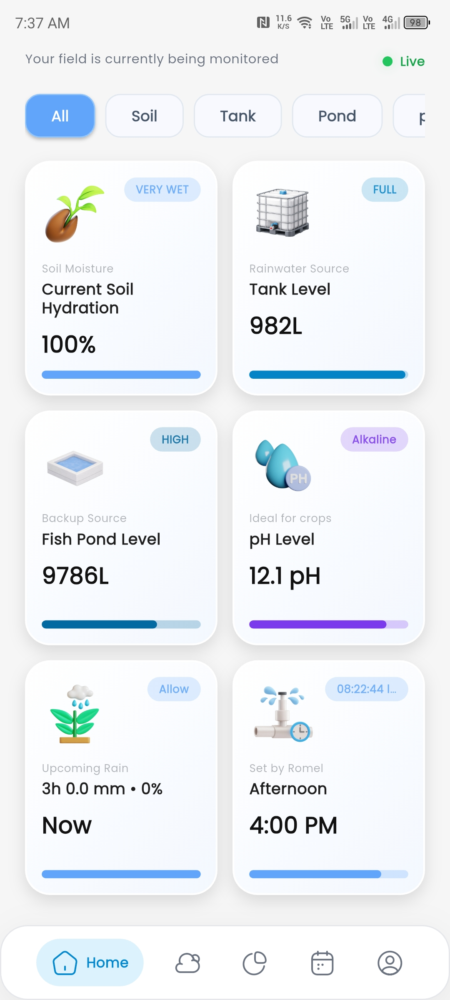
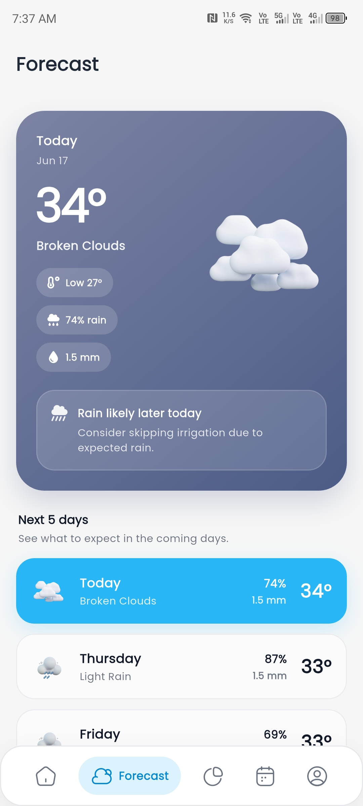
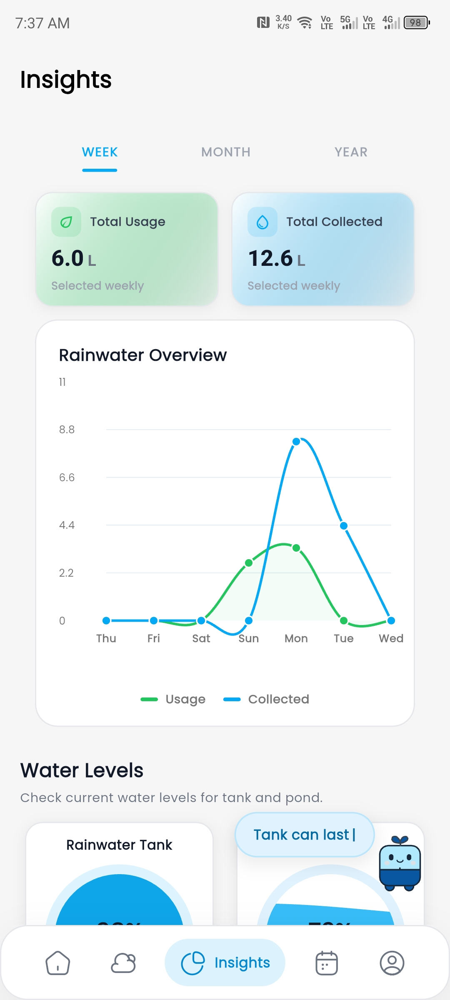
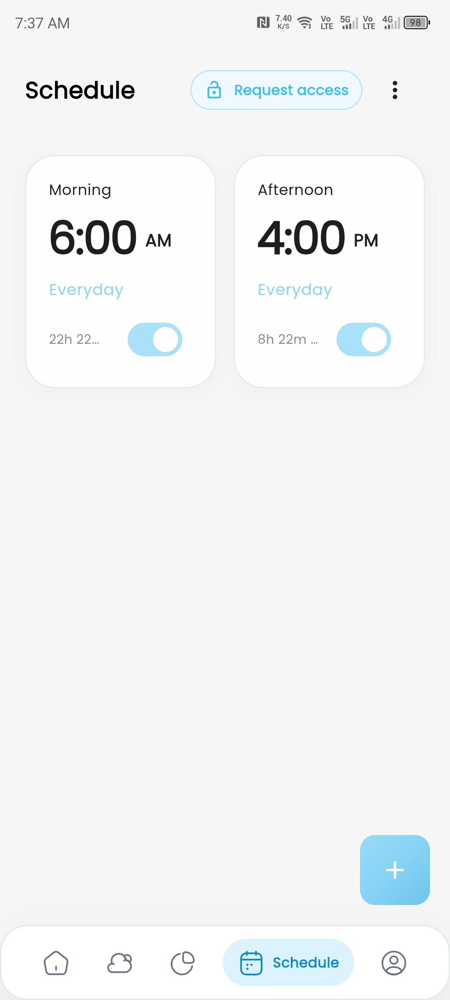
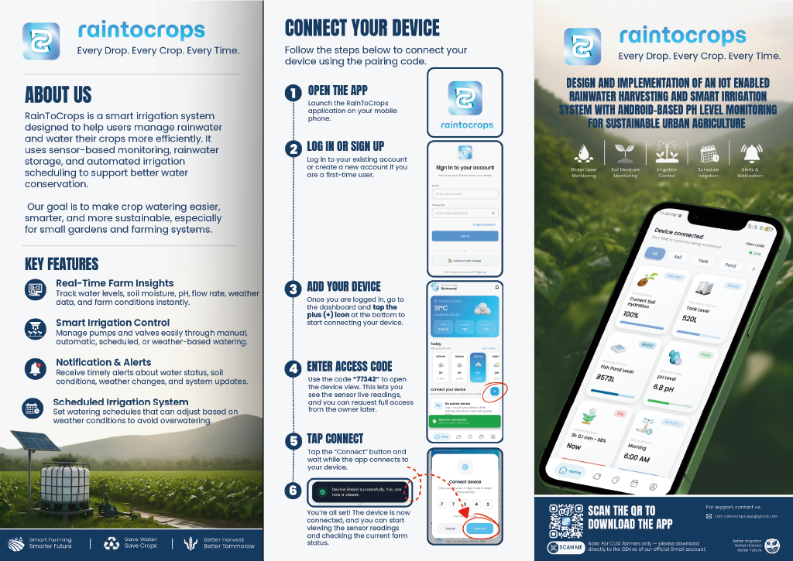
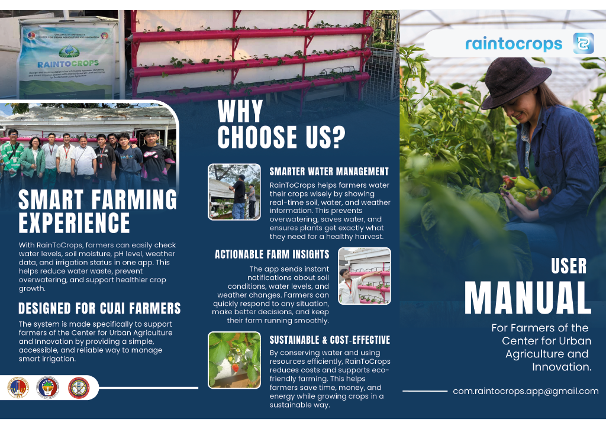

# RaintoCrops

RaintoCrops is a capstone project developed by Group 3 at Quezon City University. It focuses on promoting sustainable agriculture by providing an intelligent, mobile-first solution that helps farmers and growers monitor farm conditions and make better irrigation decisions.

The system combines a Flutter mobile application with ESP32-based hardware and MQTT communication to support real-time monitoring, water management, and user-friendly irrigation control.

## Project Overview

RaintoCrops is designed to help farmers manage irrigation more efficiently by using sensor-based monitoring and mobile app control. The project supports smarter water use by giving users access to important farm data such as water level, soil condition, and irrigation status.

This project connects software development, UI design, IoT hardware integration, and practical farm operations into one applied technology solution.

## Features

* Mobile-first interface for farm monitoring and irrigation control
* Real-time data communication using MQTT
* ESP32-based hardware integration
* Sensor monitoring for irrigation-related data
* User-friendly dashboard for easy navigation
* Water management support for sustainable farming
* Practical design intended for farmers and growers

## Tech Stack

* Flutter
* Dart
* ESP32
* MQTT
* Firebase
* Arduino IDE
* GitHub
* Visual Studio Code

## Screenshots

<table> <tr> <td align="center">  <br> <b>Splash Screen</b> </td> <td align="center">  <br> <b>Login Screen</b> </td> <td align="center">  <br> <b>Register Screen</b> </td> <td align="center">  <br> <b>Dashboard</b> </td> </tr> <tr> <td align="center">  <br> <b>Sensor Readings</b> </td> <td align="center">  <br> <b>Weather Forecast</b> </td> <td align="center">  <br> <b>Insight Screen</b> </td> <td align="center">  <br> <b>Schedule Screen</b> </td> </tr> </table>

### Project Demo Video 

[Watch the demo video](assets/screenshot/demo-vid.mp4)

### User Manual Preview





## Project Purpose

The purpose of RaintoCrops is to provide farmers with a practical tool for monitoring and managing irrigation. By using mobile technology and IoT hardware, the system helps reduce manual checking, supports better water usage, and improves access to farm condition data.

## My Role

* Designed and improved mobile app interfaces using Flutter
* Assisted in integrating ESP32 hardware with the mobile application
* Worked on user-friendly navigation and visual layout
* Supported testing and troubleshooting of system features
* Helped connect real-world farm needs with a practical technology solution
1
## Getting Started

This project is built using Flutter. To run the mobile application, make sure Flutter is installed on your device.

### Prerequisites

* Flutter SDK
* Dart
* Android Studio or Visual Studio Code
* Arduino IDE
* ESP32 board setup
* MQTT broker setup
* Firebase setup, if enabled in the project

### Installation

Clone the repository:

```bash
git clone https://github.com/rychmoon/raintocrops.git
```

Go to the project folder:

```bash
cd raintocrops
```

Install dependencies:

```bash
flutter pub get
```

Run the application:

```bash
flutter run
```

## Folder Structure

```text
raintocrops/
│
├── android/
├── assets/
│   └── images/
├── lib/
│   ├── core/
│   ├── features/
│   └── main.dart
├── pubspec.yaml
└── README.md
```

## Documentation

The project includes user manual materials, app branding assets, and system-related documentation. These files can be added in the repository to help viewers understand the purpose, features, and actual use of the project.

## Status

Final version prepared for project presentation, documentation, and portfolio use.
